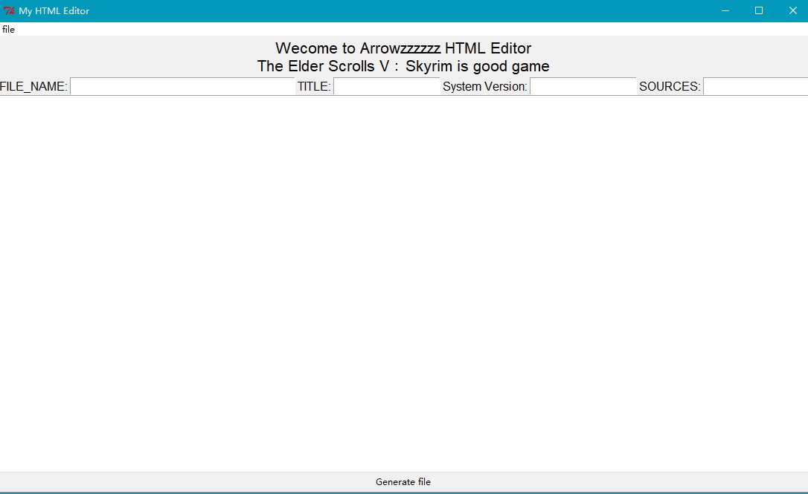
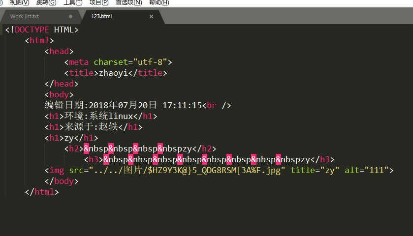

# HTML_Editor
自用图形化的HTML编辑器
可以生成H *和img标签，并且可以将生成的文件重新读取显示在图形化中。

在text中默认是H*标签，开始是H1，一个tab健是H2，2个tab健是H3，以此类推
如果要添加img标签，可以如下格式添加
img(标签名) ../../图片/$HZ9Y3K@}5_QDG8RSM[3A%F.jpg(图片路径) zy(图片说明) Arrowzzzzzz@protonmail.com(图片加载失败的联系邮箱)   每个模块以空格分开。

读取文件显示在图形化中，只能读取以该程序生成或特定格式的文件。

